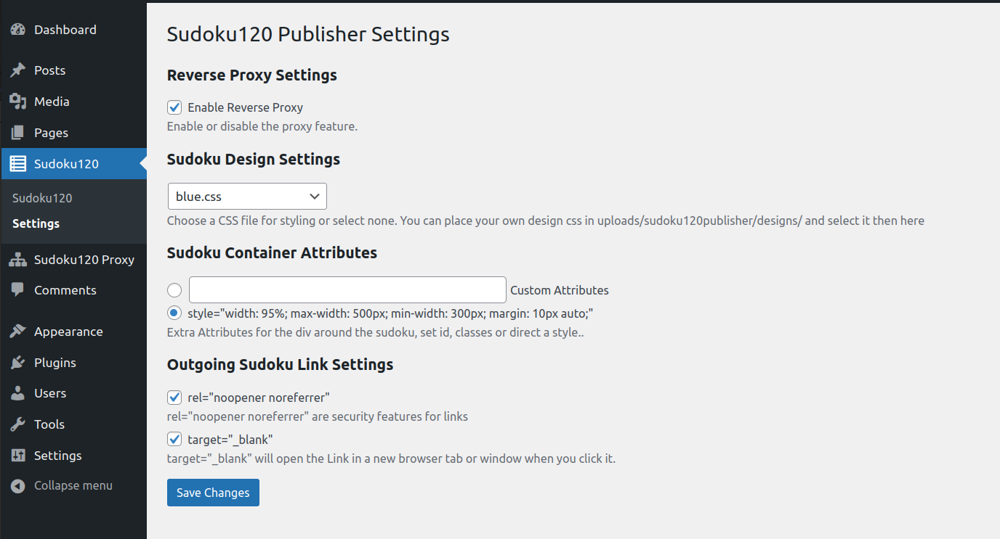
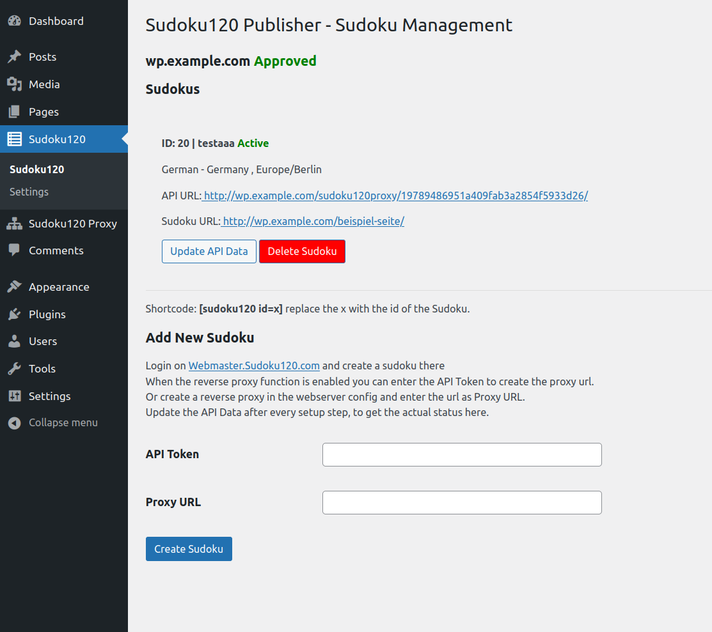

[🇩🇪 Deutsche Version](README_DE.md)

# Sudoku120 Publisher

**Contributors:** msdevcoder  
**Plugin URI:** https://github.com/sudoku120/sudoku120publisher  
**Description:** Plugin to integrate the Sudoku120.com webmaster Sudoku in WordPress.  
**Version:** 1.0.0  
**Requires at least:** 5.8  
**Tested up to:** 6.8  
**Requires PHP:** 7.4  
**License:** GPLv3 or later  
**License URI:** https://www.gnu.org/licenses/gpl-3.0.html  
**Text Domain:** sudoku120publisher  
**Domain Path:** /lang  

## Description

The Sudoku120 Publisher plugin allows you to easily integrate Sudokus from https://webmaster.sudoku120.com into WordPress. It performs the following tasks:

- Copying the required CSS and JS files.
- Registering the necessary fonts.
- Storing the Sudoku HTML code directly in the database.
- Setting up a reverse proxy in case the user is unable to configure it themselves on the web server.
- Provides a shortcode to easily embed the Sudoku on pages and posts.

Thanks to the reverse proxy, no requests are sent to external servers from the browser, and all connections are made locally. This ensures data protection-compliant usage without external data transfers.

The reverse proxy can also be used for other purposes. However, no URLs are rewritten in the returned data. To allow the transmission of the user’s IP address, user agent, and referrer, cURL must be available on the server. While it is not recommended to forward the IP address, some services require it.

There are various configuration options available for the Sudoku. The user can choose between pre-designed layouts or custom styling. Additionally, outgoing links can be enhanced with extra security features and opened in a new tab or window. The surrounding div element of the Sudoku can be customized with CSS classes, IDs, or direct style definitions.

A detailed tutorial video for setting up the plugin is available at:  
👉 https://www.youtube.com/watch?v=OAV-H_LYO2Y

For error reports, please use the GitHub function:  
👉 https://github.com/sudoku120/sudoku120publisher/issues

## Installation

1. Download the plugin from GitHub: https://github.com/sudoku120/sudoku120publisher  
2. Open your WordPress admin dashboard.  
3. Go to “Plugins” → “Add New” → “Upload Plugin”.  
4. Select the ZIP file and click “Install Now”.  
5. Activate the plugin after installation.

The default settings are already optimized for most use cases.

To embed a Sudoku:

1. Visit https://webmaster.sudoku120.com and create a new Sudoku.  
2. Follow the setup instructions in the plugin under the “Sudoku120” menu.

## Frequently Asked Questions

### Q: Do I need to configure a reverse proxy manually?
**A:** No. The plugin automatically sets up a local reverse proxy. Manual configuration is only necessary if you prefer server-side setup.

### Q: Where do I get the Sudoku to embed?
**A:** Visit https://webmaster.sudoku120.com to create and manage your Sudokus.

### Q: Can I use the plugin on multiple pages or domains?
**A:** Each Sudoku can only be used on one URL. However, you can create and embed multiple Sudokus on your site. Since the Sudokus are domain-bound, if you create multiple Sudokus, they will all show the same Sudoku, which is useful for multilingual sites.

### Q: What happens if I delete a Sudoku in WordPress?
**A:** The local HTML and the proxy configuration are removed.

### Q: Do I need to load Google Fonts?
**A:** The plugin registers Google Fonts by default. If you prefer to host the fonts locally, you will need an additional plugin to handle local hosting.

### Q: How can I style the embedded Sudoku?
**A:** You can assign custom CSS classes, IDs, or inline styles directly in the plugin settings.

### Q: Is the plugin GDPR compliant?
**A:** Yes, the plugin stores CSS and JS files locally and routes API requests through a reverse proxy without forwarding user IP addresses. No third-party requests are made, ensuring GDPR compliance. For information regarding Google Fonts, please refer to the dedicated question.

## Screenshots

1. Settings page of the plugin  
   

2. Sudoku embedded on a page  
   

3. Plugin dashboard  
   

## Other Notes

### Customizability

The appearance of the Sudoku can be customized using CSS variables. Eight default designs are installed under `uploads/sudoku120publisher/designs/` and can be selected in the plugin settings. Custom designs placed in this directory are also available for selection in the settings. Since these are CSS variables, they can also be defined in the website’s main CSS, allowing for integration with the site's light/dark theme or any other design customizations.

The Sudoku itself is encapsulated in a shadow DOM, ensuring that its internal styles do not interfere with the website’s CSS.

The surrounding `div` element, as well as the links, are outside of the shadow DOM and can therefore be styled using the website’s main CSS.

## Changelog

### 1.0.0
- Initial release of Sudoku120 Publisher plugin.
