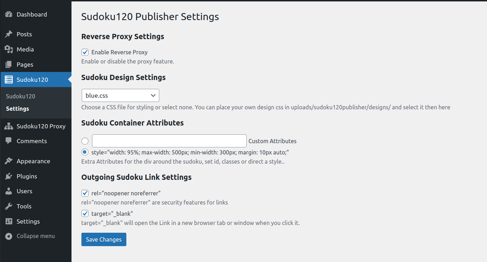

[🇬🇧 English Version](README.md)

# Sudoku120 Publisher

Sudokus von Sudoku120.com einfach in deine WordPress-Seite einbinden.

## Beschreibung

Das Sudoku120 Publisher Plugin ermöglicht es, Sudokus von [webmaster.sudoku120.com](https://webmaster.sudoku120.com) einfach in WordPress zu integrieren. Es übernimmt die folgenden Aufgaben:

- Kopieren der erforderlichen CSS- und JS-Dateien.
- Registrieren der benötigten Zeichensätze.
- Speichern des HTML-Codes für das Sudoku direkt in der Datenbank.
- Einrichten eines Reverse-Proxys für den Fall, dass der Benutzer diesen nicht selbst auf dem Webserver konfigurieren kann.
- Bietet einen Shortcode zur einfachen Einbindung des Sudokus auf Seiten und in Beiträgen.

Dank des Reverse-Proxys werden keine Anfragen vom Browser an fremde Server gesendet, sondern alle Verbindungen erfolgen lokal. Dies sorgt für eine datenschutzkonforme Nutzung ohne externe Datenübertragungen.

Der Reverse-Proxy kann auch für andere Zwecke verwendet werden. Dabei werden jedoch keine URLs in den Rückgaben umgeschrieben und es werden in beiden Richtungen keine Cookies übertragen. Der Admin kann beliebige Reverse-Proxys anlegen und dabei einstellen, ob die User-IP, der User-Agent und/oder der Referer weitergeleitet werden sollen. Die Weitergabe der IP-Adresse wird zwar nicht empfohlen, aber es gibt auch Dienste, die dies benötigen.

Es stehen verschiedene Einstellungsmöglichkeiten für das Sudoku zur Verfügung. So kann der Benutzer zwischen verschiedenen vorgefertigten Designs oder einer eigenen Gestaltung wählen. Weiterhin können ausgehende Links mit zusätzlichen Sicherheitsmerkmalen versehen und in einem neuen Tab oder Browserfenster geöffnet werden. Das umgebende `div`-Element des Sudokus kann mit benutzerdefinierten CSS-Klassen, IDs oder direkten Style-Definitionen versehen werden.

Ein ausführliches Tutorial-Video zum Setup des Plugins ist verfügbar unter: [YouTube Tutorial](https://www.youtube.com/watch?v=OAV-H_LYO2Y)

Für Fehlermeldungen bitte die GitHub-Funktion nutzen: [GitHub Issues](https://github.com/sudoku120/sudoku120publisher/issues)

## Installation

1. Lade das Plugin von GitHub herunter: [https://github.com/sudoku120/sudoku120publisher](https://github.com/sudoku120/sudoku120publisher)
2. Öffne deine WordPress-Adminoberfläche.
3. Gehe zu „Plugins“ → „Installieren“ → „Plugin hochladen“.
4. Wähle die ZIP-Datei aus und klicke auf „Jetzt installieren“.
5. Aktiviere das Plugin nach der Installation.

Die Standardeinstellungen sind bereits für die meisten Anwendungsfälle optimal gesetzt.

Um ein Sudoku einzubinden:

1. Besuche [webmaster.sudoku120.com](https://webmaster.sudoku120.com) und erstelle dort ein Sudoku.
2. Folge den Anweisungen im Plugin unter dem Menüpunkt „Sudoku120“ zur Einrichtung.

## Häufig gestellte Fragen

### Muss ich einen Reverse-Proxy manuell konfigurieren?
Nein. Das Plugin richtet automatisch einen lokalen Reverse-Proxy ein. Eine manuelle Konfiguration ist nur notwendig, wenn du eine serverseitige Einrichtung bevorzugst.

### Wo bekomme ich das Sudoku, das ich einbinden möchte?
Besuche [webmaster.sudoku120.com](https://webmaster.sudoku120.com), um Sudokus zu erstellen und zu verwalten.

### Kann ich das Plugin auf mehreren Seiten oder Domains verwenden?
Jedes Sudoku kann nur auf einer URL verwendet werden. Du kannst jedoch mehrere Sudokus auf deiner Seite erstellen und einbinden. Da die Sudokus domainengebunden sind, werden alle erstellten Sudokus dasselbe Sudoku anzeigen, was besonders für mehrsprachige Seiten nützlich ist.

### Was passiert, wenn ich ein Sudoku in WordPress lösche?
Das lokale HTML und die Proxy-Konfiguration werden entfernt.

### Muss ich Google Fonts laden?
Das Plugin registriert standardmäßig Google Fonts. Wenn du die Schriftarten lieber lokal hosten möchtest, benötigst du ein zusätzliches Plugin, das das lokale Hosting übernimmt.

### Wie kann ich das eingebettete Sudoku gestalten?
Du kannst benutzerdefinierte CSS-Klassen, IDs oder Inline-Stile direkt in den Plugin-Einstellungen zuweisen.

### Ist das Plugin DSGVO-konform?
Ja, das Plugin speichert CSS- und JS-Dateien lokal und leitet API-Anfragen über einen Reverse-Proxy, ohne die IP-Adressen der Benutzer weiterzuleiten. Es werden keine Anfragen an Dritte gestellt, was die DSGVO-Konformität gewährleistet. Weitere Informationen zu Google Fonts findest du in der entsprechenden Frage.

## Screenshots

1. Einstellungsseite des Plugins  
   

2. Sudoku auf einer Seite eingebunden  
   

3. Plugin-Dashboard  
   

## Weitere Hinweise

### Anpassbarkeit

Das Aussehen des Sudoku kann über CSS-Variablen definiert werden. Acht Standard-Designs werden unter `uploads/sudoku120publisher/designs/` installiert und sind in den Einstellungen auswählbar. Eigene Designs, die in diesem Verzeichnis abgelegt werden, sind ebenfalls in den Einstellungen auswählbar. Da es sich um CSS-Variablen handelt, können sie auch im normalen Seiten-CSS definiert werden, was eine Integration mit dem Light-/Dark-Design der Webseite oder anderen Anpassungen ermöglicht.

Das Sudoku selbst wird durch ein Shadow DOM vollständig von der restlichen Webseite abgekapselt, sodass sich dessen interne Styles nicht mit dem CSS der Webseite überschneiden.

Das umgebende `div`-Element sowie die Links befinden sich außerhalb des Shadow DOM und können daher mit dem CSS der Webseite angepasst werden.

## Externe Dienste

Dieses Plugin erfordert ein kostenloses Konto auf [webmaster.sudoku120.com](https://webmaster.sudoku120.com).

Beim Aktivieren des Plugins wird im WordPress-Uploads-Verzeichnis ein Ordner namens `sudoku120publisher` angelegt. Von [webmaster.sudoku120.com](https://webmaster.sudoku120.com) werden folgende Dateien heruntergeladen und lokal gespeichert:
- JavaScript-Datei für das Sudoku
- CSS-Datei für das Sudoku
- 8 Beispiel-Design-CSS-Dateien

Diese Dateien werden anschließend lokal von der WordPress-Installation ausgeliefert und nicht während des normalen Betriebs vom externen Server geladen.

Beim Anlegen eines neuen Sudoku wird das Sudoku-HTML von https://webmaster.sudoku120.com abgerufen und in der Datenbank gespeichert. Die Pfade zu JavaScript- und CSS-Dateien werden dabei auf die lokalen Kopien angepasst.

API-Aufrufe werden ausgeführt, wenn ein Sudoku geladen, eine Zahl aufgedeckt oder das Sudoku überprüft wird. Diese API-Aufrufe werden über einen Reverse Proxy auf der Domain der WordPress-Installation weitergeleitet.

Wenn der Reverse Proxy automatisch während der Sudoku-Konfiguration erstellt wird, wird nur der HTTP-Referer an den externen Dienst weitergegeben. Bei einer manuellen Konfiguration des Reverse Proxys (z. B. über die Webserver-Einstellungen) können zusätzlich je nach Konfiguration der User-Agent und die IP-Adresse des Nutzers (über X-Forwarded-For) übermittelt werden.

Die bei diesen API-Aufrufen übermittelten Daten umfassen:
- Sudoku-bezogene Spieldaten
- Die Domain (Host) der WordPress-Installation

Es werden keine weiteren nutzerspezifischen oder personenbezogenen Daten übermittelt.

webmaster.sudoku120.com wertet weder die IP-Adresse des Nutzers (X-Forwarded-For), noch den User-Agent oder den Referer aus. Diese werden jedoch auf Webserver-Ebene protokolliert.

Sofern keine andere Konfiguration durch den Administrator vorgenommen wird, werden keine personenbezogenen Daten der Nutzer an webmaster.sudoku120.com übermittelt. Ebenso erfolgen keine direkten Browseranfragen an https://webmaster.sudoku120.com.

In der Standardkonfiguration arbeitet das Plugin datenschutzkonform und kann ohne ausdrückliche Zustimmung der Nutzer verwendet werden.

Datenschutzerklärung: [https://webmaster.sudoku120.com/de/datenschutzerklaerung](https://webmaster.sudoku120.com/de/datenschutzerklaerung)  
Nutzungsbedingungen: [https://webmaster.sudoku120.com/de/nutzungsbedingungen](https://webmaster.sudoku120.com/de/nutzungsbedingungen)
