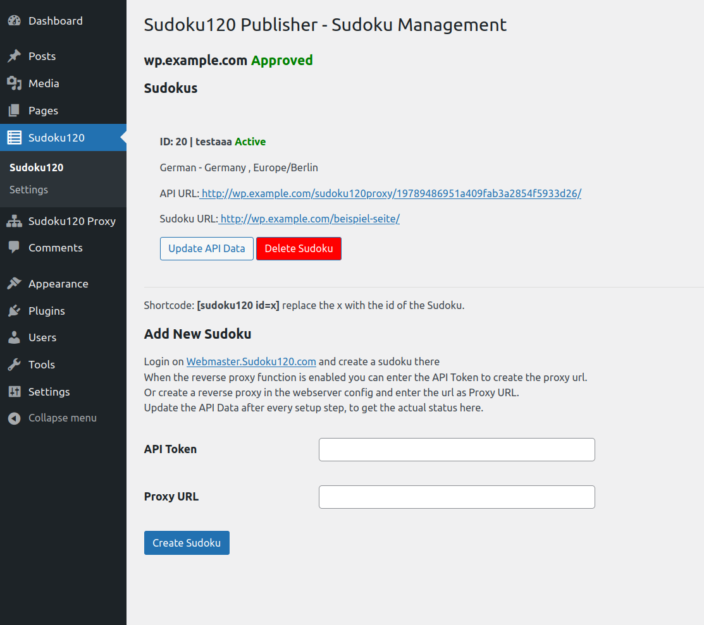

[🇬🇧 English Version](README.md)

# Sudoku120 Publisher

## Beschreibung

Das Sudoku120 Publisher Plugin ermöglicht es, Sudokus von https://webmaster.sudoku120.com einfach in WordPress zu integrieren. Es übernimmt die folgenden Aufgaben:

- Kopieren der erforderlichen CSS- und JS-Dateien.
- Registrieren der benötigten Zeichensätze.
- Speichern des HTML-Codes für das Sudoku direkt in der Datenbank.
- Einrichten eines Reverse-Proxys für den Fall, dass der Benutzer diesen nicht selbst auf dem Webserver konfigurieren kann.
- Bietet einen Shortcode zur einfachen Einbindung des Sudokus auf Seiten und in Beiträgen.

Dank des Reverse-Proxys werden keine Anfragen vom Browser an fremde Server gesendet, sondern alle Verbindungen erfolgen lokal. Dies sorgt für eine datenschutzkonforme Nutzung ohne externe Datenübertragungen.

Der Reverse-Proxy kann auch für andere Zwecke verwendet werden. Dabei werden jedoch keine URLs in den Rückgaben umgeschrieben. Um die Übertragung der User-IP-Adresse, des User-Agents und des Referrers zu ermöglichen, ist cURL auf dem Server erforderlich. Die Weitergabe der IP-Adresse wird zwar nicht empfohlen, aber es gibt auch Dienste, die dies benötigen.

Es stehen verschiedene Einstellungsmöglichkeiten für das Sudoku zur Verfügung. So kann der Benutzer zwischen verschiedenen vorgefertigten Designs oder einer eigenen Gestaltung wählen. Weiterhin können ausgehende Links mit zusätzlichen Sicherheitsmerkmalen versehen und in einem neuen Tab oder Browserfenster geöffnet werden. Das umgebende `div`-Element des Sudokus kann mit benutzerdefinierten CSS-Klassen, IDs oder direkten Style-Definitionen versehen werden.

Ein ausführliches Tutorial-Video zum Setup des Plugins ist verfügbar unter:  
👉 https://www.youtube.com/watch?v=OAV-H_LYO2Y

Für Fehlermeldungen bitte die GitHub-Funktion nutzen:  
👉 https://github.com/sudoku120/sudoku120publisher/issues

## Installation

1. Lade das Plugin von GitHub herunter: https://github.com/sudoku120/sudoku120publisher  
2. Öffne deine WordPress-Adminoberfläche.  
3. Gehe zu „Plugins“ → „Installieren“ → „Plugin hochladen“.  
4. Wähle die ZIP-Datei aus und klicke auf „Jetzt installieren“.  
5. Aktiviere das Plugin nach der Installation.

Die Standardeinstellungen sind bereits für die meisten Anwendungsfälle optimal gesetzt.

Um ein Sudoku einzubinden:

1. Besuche https://webmaster.sudoku120.com und erstelle dort ein Sudoku.  
2. Folge den Anweisungen im Plugin unter dem Menüpunkt „Sudoku120“ zur Einrichtung.

## Häufig gestellte Fragen

### F: Muss ich einen Reverse-Proxy manuell konfigurieren?
**A:** Nein. Das Plugin richtet automatisch einen lokalen Reverse-Proxy ein. Eine manuelle Konfiguration ist nur notwendig, wenn du eine serverseitige Einrichtung bevorzugst.

### F: Wo bekomme ich das Sudoku, das ich einbinden möchte?
**A:** Besuche https://webmaster.sudoku120.com, um Sudokus zu erstellen und zu verwalten.

### F: Kann ich das Plugin auf mehreren Seiten oder Domains verwenden?
**A:** Jedes Sudoku kann nur auf einer URL verwendet werden. Du kannst jedoch mehrere Sudokus auf deiner Seite erstellen und einbinden. Da die Sudokus domainengebunden sind, werden alle erstellten Sudokus dasselbe Sudoku anzeigen, was besonders für mehrsprachige Seiten nützlich ist.

### F: Was passiert, wenn ich ein Sudoku in WordPress lösche?
**A:** Das lokale HTML und die Proxy-Konfiguration werden entfernt.

### F: Muss ich Google Fonts laden?
**A:** Das Plugin registriert standardmäßig Google Fonts. Wenn du die Schriftarten lieber lokal hosten möchtest, benötigst du ein zusätzliches Plugin, das das lokale Hosting übernimmt.

### F: Wie kann ich das eingebettete Sudoku gestalten?
**A:** Du kannst benutzerdefinierte CSS-Klassen, IDs oder Inline-Stile direkt in den Plugin-Einstellungen zuweisen.

### F: Ist das Plugin DSGVO-konform?
**A:** Ja, das Plugin speichert CSS- und JS-Dateien lokal und leitet API-Anfragen über einen Reverse-Proxy, ohne die IP-Adressen der Benutzer weiterzuleiten. Es werden keine Anfragen an Dritte gestellt, was die DSGVO-Konformität gewährleistet. Weitere Informationen zu Google Fonts findest du in der entsprechenden Frage.

## Screenshots

1. Einstellungsseite des Plugins  
   

2. Sudoku auf einer Seite eingebunden  
   

3. Plugin-Dashboard  
   

## Weitere Hinweise

### Anpassbarkeit

Das Aussehen des Sudokus kann über CSS-Variablen definiert werden. Acht Standard-Designs werden unter `uploads/sudoku120publisher/designs/` installiert und sind in den Einstellungen auswählbar. Eigene Designs, die in diesem Verzeichnis abgelegt werden, sind ebenfalls in den Einstellungen auswählbar. Da es sich um CSS-Variablen handelt, können sie auch im normalen Seiten-CSS definiert werden, was eine Integration mit dem Light-/Dark-Design der Webseite oder anderen Anpassungen ermöglicht.

Das Sudoku selbst wird durch ein Shadow DOM vollständig von der restlichen Webseite abgekapselt, sodass sich dessen interne Styles nicht mit dem CSS der Webseite überschneiden.

Das umgebende `div`-Element sowie die Links befinden sich außerhalb des Shadow DOM und können daher mit dem CSS der Webseite angepasst werden.

## Changelog

### 1.0.0
- Erste Veröffentlichung des Sudoku120 Publisher Plugins.
